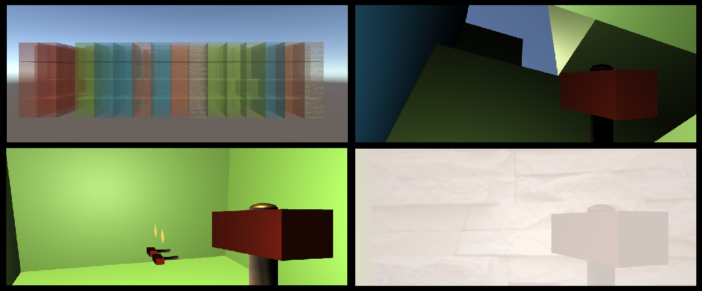

# Maze-Unity

Maze-Unity is a 3D Unity3D game developed as a project for Computer Graphics and Interactive Systems, an undergraduate course in Computer Science and Engineering Department, University of Ioannina (2019). This game could be hugely improved and it was made as a way to get familiar with computer graphics and Unity3D. It is a maze escape game.

## Rules
* When your hammer hits a block, it loses durability.
* Each block drops a random number of boxes which can contain extra hammers.
* When your hammer loses all of its' durability it turns black.
* Black colored blocks are teleporters, which teleport you a level above.
* Player wins when he is on top of the maze.

## Controls
* WASD/Arrows for player movement.
* Spacebar for jumping.
* X to end the game.
* E to end the game on top level (win).
* C to view the level from afar.
  * J/K to turn around the level.
* H to break a block using the hammer.

Made by: Grigorios Tsopouridis
